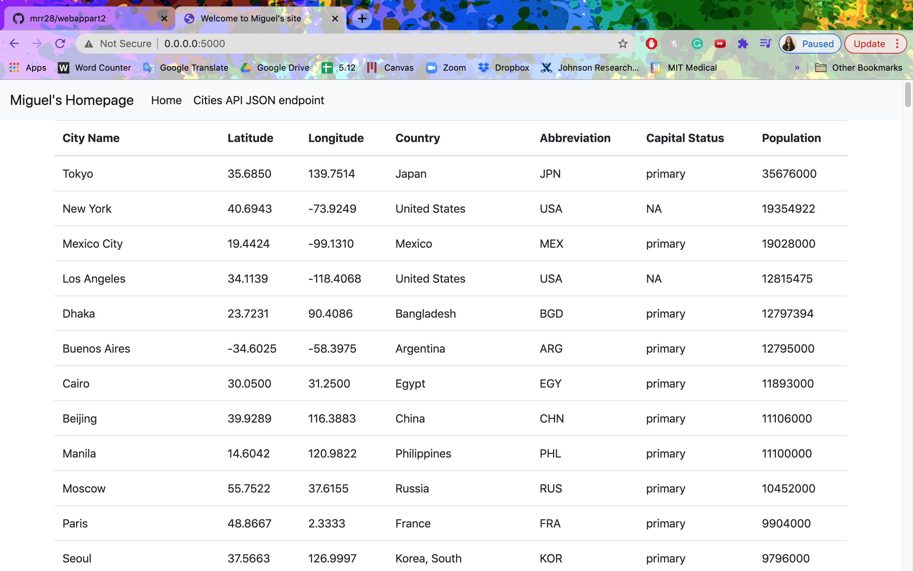
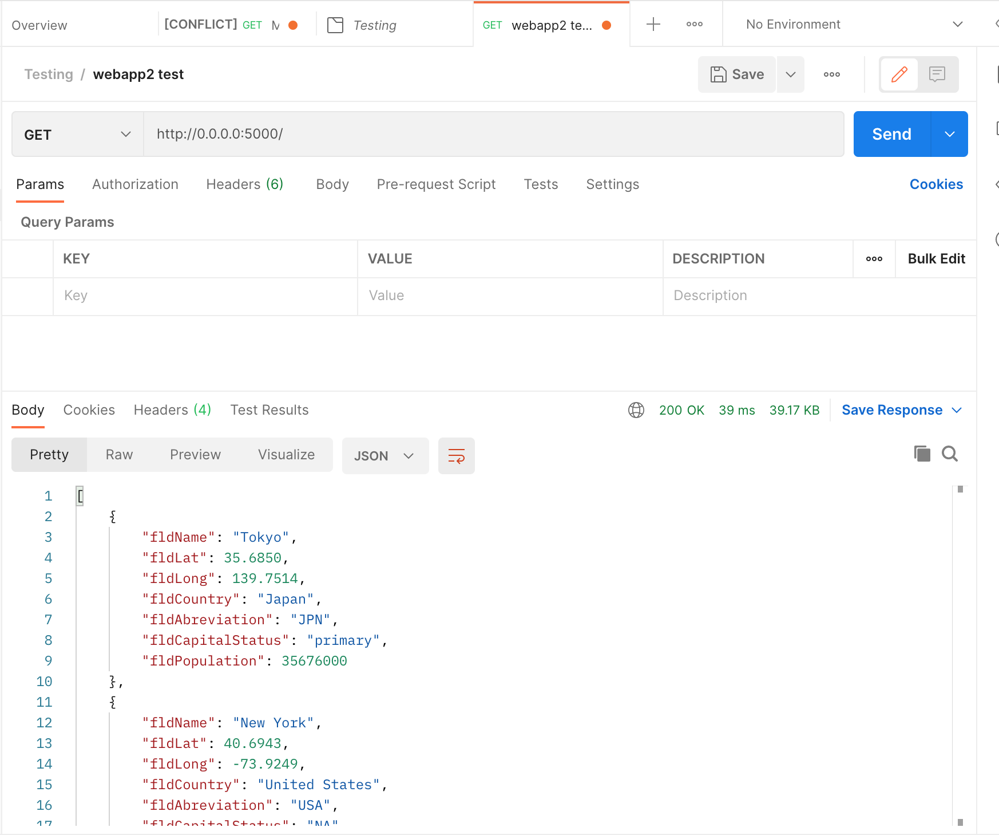

# webappart2

## Project Description
This project is a homework assignment to teach how to get Pycharm setup with Docker, Flask, MySQL

## Miguel Home Page Screenshot

## Postman Screenshot

## Query Screenshot

